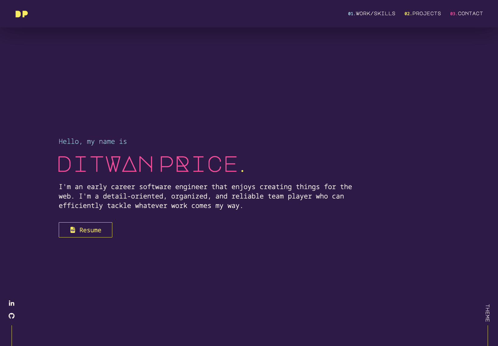

# Description
This is version 2 of my portfolio site. This time around, I redesigned how the site is navigated using react router and framer motion for animating in elements. I also added a personal touch by including the option to change the theming of the site. The themes listed on the site are inspired by the color profiles of custom keycaps for mechanical keyboards. 

# Tools Used
- React.js
- React Router
- JavaScript
- Html
- Sass
- Framer Motion (Animation library for React)
